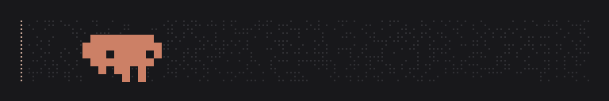

# clawd-mods

**English** · [Français](README.fr.md)

A little pixel-art Clawd that lives under the Claude Code spinner and acts out
what Claude is doing, in front of a field of twinkling dots that doubles as
the progress bar of Claude's task list.



**It costs nothing.** Everything is drawn from what the session already knows
(the spinner's mode, the tools Claude calls, the task list, the usage
figures). No model is ever called, no prompt is added, no tokens are spent.

> An independent fan project, not affiliated with or endorsed by Anthropic.
> Clawd is Anthropic's mascot.

## What Clawd does

- **Follows the work.** A pickaxe while Claude searches, a hammer while it
  edits, a little screen with green code while it runs a command, a
  magnifying glass while it reads. A command that runs over 20 seconds gets
  a coffee.
- **Reacts to your workflow.** `git commit` plants a flag, `git push` rides
  a rocket, tests make him juggle and then lift a trophy (or sit under a
  rain cloud if they fail), `npm install` and friends rain boxes on him.
- **Shows progress.** While Claude works through a task list, the dots are
  lit and twinkling up to the current task and grey beyond it, with the
  task's name and percentage in the corner. Each finished task gets
  confetti; the whole list gets fireworks.
- **Roams in costume** when there is nothing more specific to do: cape
  flight, race car, jetpack, skateboard, laser gun, magician (who conjures
  bunnies, frogs, birds, ducks, snails and butterflies), DJ, pirate,
  astronaut, knight against a bug-dragon, bug chase.
- **Lives a little.** A light bulb after a long think, a "?" sign when
  Claude waits on you, a crown after ten tool calls without an error,
  sweat near a usage limit, a backpack overflowing when the context is
  nearly full, little helper Clawds for each subagent, a starry night after
  21:00, bats at Halloween, snow at Christmas, and now and then a cat or a
  shooting star.
- Type **`danse clawd`** in a prompt and see.

## Install

You need Claude Code with **plugin hook modules**, an early-access feature
(this was built on 2.1.288).

In Claude Code:

```
/plugin marketplace add 0xR4vens/clawd-mods
/plugin install clawd-mods@clawd-mods
```

Then restart Claude Code. To update later:
`/plugin marketplace update clawd-mods`.

### From a clone

1. Clone the repo:

   ```sh
   git clone https://github.com/0xR4vens/clawd-mods ~/src/clawd-mods
   ```

2. Try it for one session:

   ```sh
   claude --plugin-dir ~/src/clawd-mods
   ```

3. To load it in every session, add the folder to the `env` block of
   `~/.claude/settings.json` (full path), then restart Claude Code:

   ```json
   {
     "env": { "CLAUDE_CODE_PLUGIN_DIRS": "/home/you/src/clawd-mods" }
   }
   ```

Nothing shows up? Run `claude --debug` and look for a `clawd-mods` line.
Clawd only appears while Claude is working, and only in the terminal.

## Commands

| Command | |
|---|---|
| `/clawd` | Show or hide Clawd |
| `/clawd fond` | Turn the dots backdrop on or off |
| `/clawd <role>` | Keep one role: `marche`, `cape`, `pilote`, `jetpack`, `skate`, `laser`, `magicien`, `dj`, `pirate`, `astronaute`, `chevalier`, `chasse` |
| `/clawd aléatoire` | Let him change roles again |

## Development

- `hooks/art.ts` draws everything (pure functions, no engine calls).
- `hooks/register.tsx` holds every hook: the engine follows `$` within one
  file only.
- `claude plugin validate .` and `claude plugin test .` check it.
- `node --experimental-strip-types scripts/demo-gif.ts docs/demo.gif`
  regenerates the demo GIF (no dependencies).
- `scripts/promo.ts` renders the 1080p promo clips (needs ffmpeg with libass,
  and the Poppins and DM Sans fonts).

## License

MIT. See [LICENSE](LICENSE).
